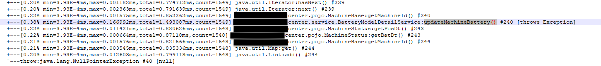
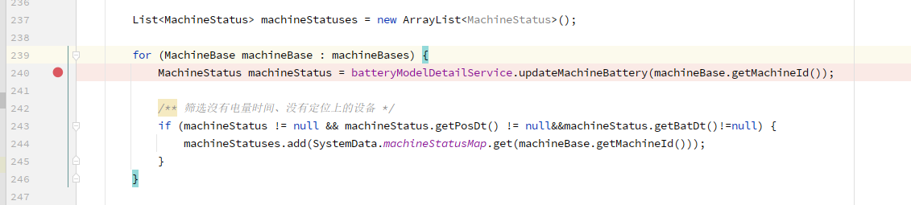
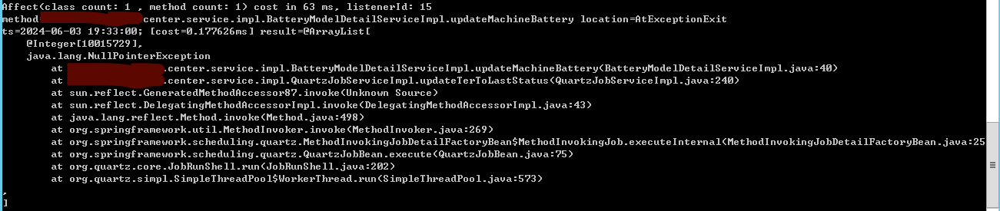
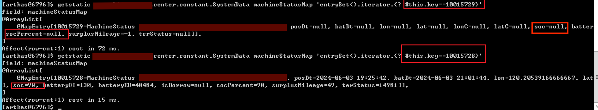

### 一个线上的NPE

```
[ERROR]14:11:00 startQuertz_Worker-3 org.quartz.core.JobRunShell Job DEFAULT.updateTerToLastStatusJob threw an unhandled Exception: 
org.springframework.scheduling.quartz.JobMethodInvocationFailedException: Invocation of method 'updateTerToLastStatus' on target class [class com.center.service.impl.QuartzJobServiceImpl] failed; nested exception is java.lang.NullPointerException
	at org.springframework.scheduling.quartz.MethodInvokingJobDetailFactoryBean$MethodInvokingJob.executeInternal(MethodInvokingJobDetailFactoryBean.java:266)
	at org.springframework.scheduling.quartz.QuartzJobBean.execute(QuartzJobBean.java:75)
	at org.quartz.core.JobRunShell.run(JobRunShell.java:202)
	at org.quartz.simpl.SimpleThreadPool$WorkerThread.run(SimpleThreadPool.java:573)
Caused by: java.lang.NullPointerException
    
[ERROR]14:11:00 startQuertz_Worker-3 org.quartz.core.ErrorLogger Job (DEFAULT.updateTerToLastStatusJob threw an exception.
org.quartz.SchedulerException: Job threw an unhandled exception. [See nested exception: org.springframework.scheduling.quartz.JobMethodInvocationFailedException: Invocation of method 'updateTerToLastStatus' on target class [class com.center.service.impl.QuartzJobServiceImpl] failed; nested exception is java.lang.NullPointerException]
	at org.quartz.core.JobRunShell.run(JobRunShell.java:213)
	at org.quartz.simpl.SimpleThreadPool$WorkerThread.run(SimpleThreadPool.java:573)
Caused by: org.springframework.scheduling.quartz.JobMethodInvocationFailedException: Invocation of method 'updateTerToLastStatus' on target class [class com.center.service.impl.QuartzJobServiceImpl] failed; nested exception is java.lang.NullPointerException
	at org.springframework.scheduling.quartz.MethodInvokingJobDetailFactoryBean$MethodInvokingJob.executeInternal(MethodInvokingJobDetailFactoryBean.java:266)
	at org.springframework.scheduling.quartz.QuartzJobBean.execute(QuartzJobBean.java:75)
	at org.quartz.core.JobRunShell.run(JobRunShell.java:202)
	... 1 more
Caused by: java.lang.NullPointerException
```

- 问题
    1. 没有更多updateTerToLastStatus相关的日志
    2. 业务不接受重启
    3. 重启会破坏现场, 短时间无法复现bug
    4. 现在只靠review code基本无法发现问题

- 使用Arthas
    1. 根据服务端口找到进程号
        ```shell
        netstat -ano | findstr 8069
        ```
    2. 根据进程号启动arthas, 执行trace
        ```shell
        trace com.center.service.impl.QuartzJobServiceImpl updateTerToLastStatus  -n 5 --skipJDKMethod false
        ```

        
        
        NPE出现在`#40`
    3. 然后使用watch打印异常和参数
        ```shell
        watch com.center.service.impl.BatteryModelDetailServiceImpl updateMachineBattery "{params[0],throwExp}" -e -x 2
        ```
        
        可以看到具体的异常信息和参数`10015729`
    4. 验证猜测, 使用getstatic+ognl
        ```shell
        getstatic com.center.constant.SystemData machineStatusMap 'entrySet().iterator.{? #this.key==10015729}'
        ```
        

- 最后关于最开始的NPE信息

    npe会被jvm当热点异常优化掉, 当npe输出过多的时候信息会变少, 故去找最早的异常, 可以看到更多的异常信息;


### 回忆jsp(java server page)

最早的动态页面是在cgi时代, 这个时候都是脚本, 直接改代码加日志加好.

后来在jsp这种动态页面时代, tomcat这种web容器会判断jsp文件是否被更改, 如果更改, 就将jsp翻译成一个新的servlet类, 加载到jvm中去, 之后的所有请求, 都由新的servlet处理; 问题是根据类加载机制(bootstrap->extension->app->自定义类加载器), 同一个类只能被加载一次, 那jsp是如何实现的呢? 

tomcat 自定义了[Jsp classLoader](https://cloud.tencent.com/developer/article/2030955)来实现servlet类的替换, 当jsp文件更改, 会删除就的jsp classloader, 换成新的;

HTTP服务是无状态的，所以JSP的场景基本上都是一次性消费，这种通过创建新的ClassLoader来“替换”class的做法行得通，但是对于其他应用，比如Spring框架，即便这样做了，对象多数是单例，对于内存中已经创建好的对象，我们无法通过这种创建新的ClassLoader实例的方法来修改对象行为。

### Instrumentation

一个类分成两个部分, 属性和方法, 方法时存在方法区中, 类变量应该是存在堆上, 函数变量应该是存在栈上

总之: 我们可以修改字节码中目标方法所在的区域, 然后重新加载这个类,  这样方法区中的对象行为（方法）就被改变了，而且不改变对象的属性，也不影响已经存在对象的状态;

- java.lang.instrument.Instrumentation定义了两个接口

    `redefineClasses` 和 `retransformClasses`; 一个是重新定义class，一个是修改class。这两个大同小异，都是替换已经存在的class文件，redefineClasses是自己提供字节码文件替换掉已存在的class文件，retransformClasses是在已存在的字节码文件上修改后再替换之。

    - redefineClasses 

        对于有java源码的类, 我们直接重新编译一下得到字节码文件, 然后redefineClasses就好

    - retransformClasses

        对于没有java源码的类, 咋整?直接使用直接编辑字节码的框架, 如`Byte Buddy`,`ASM` ，他们提供接口可以让我们方便地操作字节码文件，进行注入修改类的方法，动态创造一个新的类等等操作。其中最著名的框架应该就是ASM了，cglib、Spring等框架中对于字节码的操作就建立在ASM之上。

        我们都知道，Spring的AOP是基于动态代理实现的，Spring会在运行时动态创建代理类，代理类中引用被代理类，在被代理的方法执行前后进行一些神秘的操作。那么，Spring是怎么在运行时创建代理类的呢？动态代理的美妙之处，就在于我们不必手动为每个需要被代理的类写代理类代码，Spring在运行时会根据需要动态地创造出一个类，这里创造的过程并非通过字符串写Java文件，然后编译成class文件，然后加载。Spring会直接“创造”一个class文件，然后加载，创造class文件的工具，就是ASM了。

        到这里，我们知道了**用ASM框架直接操作class文件**，在类中加一段打印日志的代码，然后调用retransformClasses就可以了。

### 增强版直接操作字节码的工具: BTrace

BTrace基于ASM、Java Attach Api、Instruments开发，为用户提供了很多注解。依靠这些注解，我们可以编写BTrace脚本（简单的Java代码）达到我们想要的效果，而不必深陷于ASM对字节码的操作中不可自拔。
它帮我们**寻找字节码，修改字节码，然后reTransform**

```java

package com.sun.btrace.samples;

import com.sun.btrace.annotations.*;
import com.sun.btrace.AnyType;
import static com.sun.btrace.BTraceUtils.*;

/**
BTrace官方提供的一个简单例子：拦截所有java.io包中所有类中以read开头的方法，打印类名、方法名和参数名。当程序IO负载比较高的时候，就可以从输出的信息中看到是哪些类所引起
 */
@BTrace public class ArgArray {
    @OnMethod(
        clazz="/java\\.io\\..*/",
        method="/read.*/"
    )
    public static void anyRead(@ProbeClassName String pcn, @ProbeMethodName String pmn, AnyType[] args) {
        println(pcn);
        println(pmn);
        printArray(args);
    }
}
```

BTrace主要有下面几个模块：

1. BTrace脚本：利用BTrace定义的注解，我们可以很方便地根据需要进行脚本的开发。
2. Compiler：将BTrace脚本编译成BTrace class文件。
3. Client：将class文件发送到Agent。
4. Agent：基于Java的Attach Api，Agent可以动态附着到一个运行的JVM上(Instrument 要求在运行前利用命令行参数或者系统参数来设置代理类)，然后开启一个BTrace Server，接收client发过来的BTrace脚本；解析脚本，然后根据脚本中的规则找到要修改的类；修改字节码后，调用Java Instrument的reTransform接口，完成对对象行为的修改并使之生效。

BTrace对JVM来说是“只读的”, 不允许对 JVM 状态做有副作用的改动，因此BTrace的使用有许多限制, 如: 不允许有内部类、嵌套类, 不允许有同步方法和同步块(避免死锁风险。如果 BTrace 脚本中使用锁，可能和业务线程争锁造成死锁), 不允许创建对象(避免 GC 压力或内存泄露，防止你在 BTrace 中写内存泄露代码), 不能抛异常(避免改变原业务逻辑流程。BTrace 不应该影响被观测方法的行为)等等!!!!
