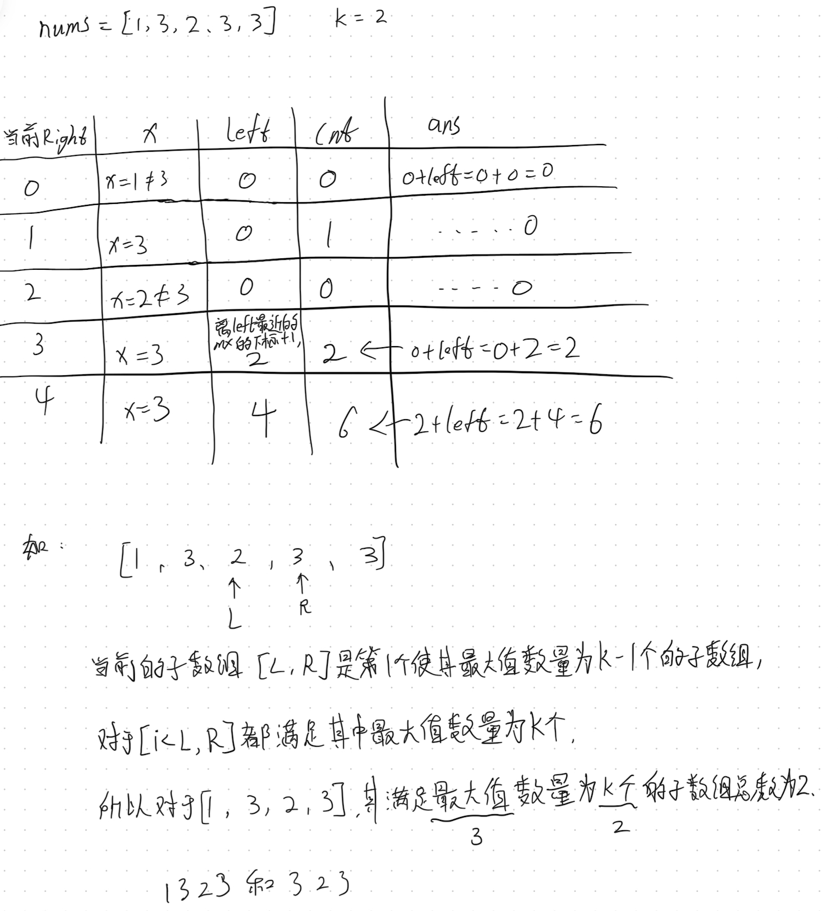

## 2962. 统计最大元素至少出现k次的子数组
```java
class Solution {
    public long countSubarrays(int[] nums, int k) {
        int mx = Arrays.stream(nums).max().getAsInt();
        long ans = 0;
        int cnt = 0, left = 0;
        for (int x : nums) {
            if (x == mx) {
                cnt++;
            }
            while (cnt == k) {
                if (nums[left] == mx) {
                    cnt--;
                }
                left++;
            }
            ans += left;
        }
        return ans;
    }
}

作者：力扣官方题解
链接：https://leetcode.cn/problems/count-subarrays-where-max-element-appears-at-least-k-times/solutions/3652653/tong-ji-zui-da-yuan-su-chu-xian-zhi-shao-348l/
来源：力扣（LeetCode）
著作权归作者所有。商业转载请联系作者获得授权，非商业转载请注明出处。
```

### 我的题解
```java
class Solution {
    public long countSubarrays(int[] nums, int k) {
        long re = 0;
        int mx = Arrays.stream(nums).max().getAsInt();
        int count = 0;
        for(int i=0, j=0; j<nums.length; j++){
            if(nums[j]==mx) count++;
            while(count==k){
                if(nums[i]==mx) count--;
                i++;
            }
            re += i;
        }
        return re;
    }
}
```