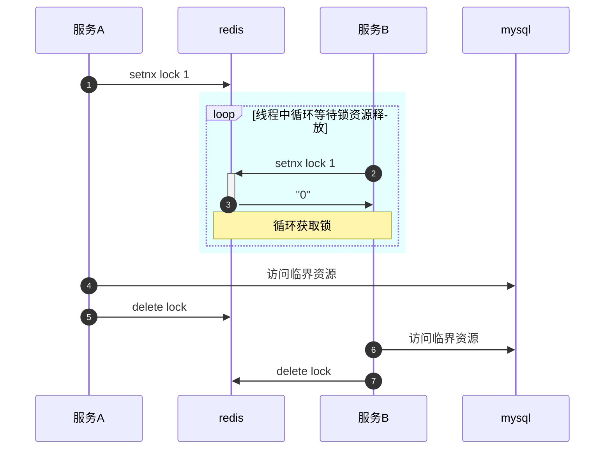

# test
#### Mermaid

<Mermaid
  chart="
sequenceDiagram
autonumber
    服务A ->> redis : setnx lock 1
    %% 这里是一个注释代码
    rect rgba(0,255,255,.1)
        loop 线程中循环等待锁资源释放
            服务B ->> +redis : setnx lock 1
            redis ->> -服务B : 0
            Note over redis,服务B : 循环获取锁
        end
    end
    服务A ->> mysql : 访问临界资源
    服务A ->> redis : delete lock
    服务B ->> mysql : 访问临界资源
    服务B ->> redis : delete lock"
/>

