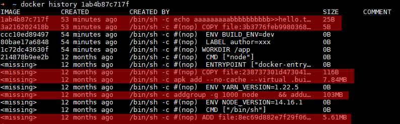
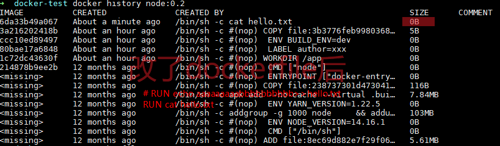
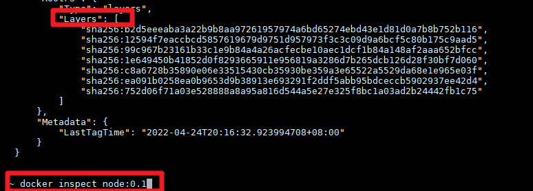
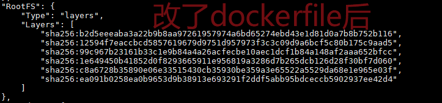
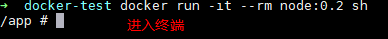
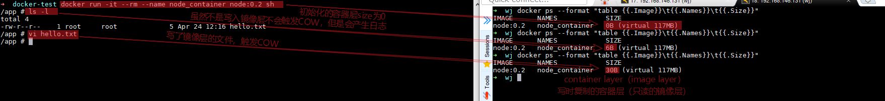

## 层_镜像_容器de关系

import { Accordion, Accordions } from 'fumadocs-ui/components/accordion';

<Accordions type="single" defaultValue='dockerfile1'>
  <Accordion title="测试用的Dockerfile" id="dockerfile1">
    ```dockerfile lineNumbers
    FROM node:14.16.1-alpine3.13
    WORKDIR /app

    LABEL author="xxx"
    ENV BUILD_ENV=dev


    COPY ./hello.txt ./ # echo test > hello.txt

    RUN echo aaaaaaaaabbbbbbbbbb>>hello.txt
    # RUN cat hello.txt	
    ```
  </Accordion>
</Accordions>

### layer 层

- Dockerfile 中那些命令会增加一层？

  - 除了配置类的参数（ENV，LABEL等），其他的都会增加一层

- 镜像的层与层之间有没有关系？

  - Copy On Write 写入时复制

    > cow在docker中就是：几个image基于同一个image（假设叫foo）的时候，这个foo被共享给多个image读取，有image要写foo的某一层的东西（iamge由层组成）的时候把foo中这一层单独copy给他，其他没有写操作的镜像还是用共享的image。

    

    

  - 对比前后两个dockerfile, 得到结论: `cat hello.txt`没有'写'操作, 故size=0B

### image 镜像

- 镜像是由层组成的
    
    
- 可以看到修改后的layers数组少了一个


### container 容器

- 镜像和容器之间是啥关系？

  - 镜像是多个层组成的。
  - 当一个镜像构建完后，这个镜像的所有东西就是只读的了。
  - 当基于一个镜像去创建容器的时候就是又增加了一层。这一层就是可读可写的。
  - 容器要想写镜像中的东西，就先copy一层，这层可读可写。

  

- 不同容器之间有隔离，但是又基于一个写时复制的只读镜像，所以不会太占硬盘。
  
  
  - 
  - 
- 镜像和容器占用磁盘空间的计算
  - 对于镜像来说
    镜像是由层来组成的，有些层可能是多个镜像共享的。所以多个镜像的磁盘占用不一定就是求和，所以某些镜像的磁盘占用可能很低。
  - 对于容器来说
    一个镜像启动了多个容器，磁盘占用空间就是一个镜像的大小加多个容器层的大小的和。容器层会有copy on write产生的磁盘占用或者日志啥的。

---

## 多阶段构建

### 作用

  - 多阶段构建优化了Dockerfile，使Dockerfile更容易阅读和维护

  #### 没有多阶段构建之前
    1. 基于golang基础镜像，编译一个go程序

    ```dockerfile
    这是 Dockerfile.build
    # syntax=docker/dockerfile:1
    FROM golang:1.16
    WORKDIR /go/src/github.com/alexellis/href-counter/
    COPY app.go ./
    RUN go get -d -v golang.org/x/net/html \
      && CGO_ENABLED=0 GOOS=linux go build -a -installsuffix cgo -o app .
    ```

    2. 基于最小的linux，运行一个go程序

    ```dockerfile
    这是 Dockerfile.build
    # syntax=docker/dockerfile:1
    FROM alpine:latest  
    RUN apk --no-cache add ca-certificates
    WORKDIR /root/
    COPY app ./
    CMD ["./app"]  
    ```

    3. 还需要使用脚本操作这两个Dockerfile

    ```shell
    #!/bin/sh
    echo Building alexellis2/href-counter:build
    # 构建第一个Dockerfile
    docker build --build-arg https_proxy=$https_proxy --build-arg http_proxy=$http_proxy \  
        -t alexellis2/href-counter:build . -f Dockerfile.build
    # 把第一个Dockerfile编译号的go程序copy到宿主机
    docker container create --name extract alexellis2/href-counter:build  
    docker container cp extract:/go/src/github.com/alexellis/href-counter/app ./app 
    # 删除第一个用作编译go程序的容器
    docker container rm -f extract
    
    echo Building alexellis2/href-counter:latest
    # 构建第二个Dockerfile，运行go程序
    docker build --no-cache -t alexellis2/href-counter:latest .
    rm ./app
    ```

  #### 使用多阶段构建进行优化后

    > 只需要单个 Dockerfile，也不需要单独的构建脚本，不需要创建任何中间图像，也不需要将任何文件拷贝到宿主机。
    >
    > 只需要： docker build -t alexellis2/href-counter:latest .

    ```dockerfile
    # syntax=docker/dockerfile:1
    FROM golang:1.16
    WORKDIR /go/src/github.com/alexellis/href-counter/
    RUN go get -d -v golang.org/x/net/html  
    COPY app.go ./
    RUN CGO_ENABLED=0 GOOS=linux go build -a -installsuffix cgo -o app .
    
    FROM alpine:latest  
    RUN apk --no-cache add ca-certificates
    WORKDIR /root/
    # COPY下标为0的第一个FROM中的go程序
    COPY --from=0 /go/src/github.com/alexellis/href-counter/app ./
    CMD ["./app"]  
    ```

### 常用技巧

  - 可以对阶段取别名，避免使用整数下标来引用

    ```dockerfile
    # syntax=docker/dockerfile:1
    FROM golang:1.16 AS builder
    WORKDIR /go/src/github.com/alexellis/href-counter/
    RUN go get -d -v golang.org/x/net/html  
    COPY app.go    ./
    RUN CGO_ENABLED=0 GOOS=linux go build -a -installsuffix cgo -o app .
    
    FROM alpine:latest  
    RUN apk --no-cache add ca-certificates
    WORKDIR /root/
    COPY --from=builder /go/src/github.com/alexellis/href-counter/app ./
    CMD ["./app"]  
    ```

  - 构建镜像时，可以指定构建到那个阶段，可以应用的debug场景

    ```shell
     docker build --target builder -t alexellis2/href-counter:latest .
    ```

  - 多阶段构建时，不是只能从之前在 Dockerfile 中创建的阶段进行复制。

    > 可以使用该COPY --from指令从单独的镜像中复制
    >
    > 可以使用本地镜像名称、本地或 Docker 注册表上可用的标签或标签 ID
    >
    > 如有必要，Docker 客户端会拉取镜像并从镜像中复制。

    ```shell
    COPY --from=nginx:latest /etc/nginx/nginx.conf /nginx.conf
    ```

  - 使用前一个阶段作为新阶段

    > 使用FROM时，可以引用之前的阶段

    ```dockerfile
    # syntax=docker/dockerfile:1
    FROM alpine:latest AS builder
    RUN apk --no-cache add build-base
    
    FROM builder AS build1
    COPY source1.cpp source.cpp
    RUN g++ -o /binary source.cpp
    
    FROM builder AS build2
    COPY source2.cpp source.cpp
    RUN g++ -o /binary source.cpp
    ```


----------

- [image-multistage-build-官方文档](https://docs.docker.com/develop/develop-images/multistage-build/)
- [docker 的 layer, image, container 概念梳理-findxc](https://github.com/findxc/blog/issues/57)
- [image和layer的关系-官方文档](https://docs.docker.com/storage/storagedriver/#images-and-layers)
