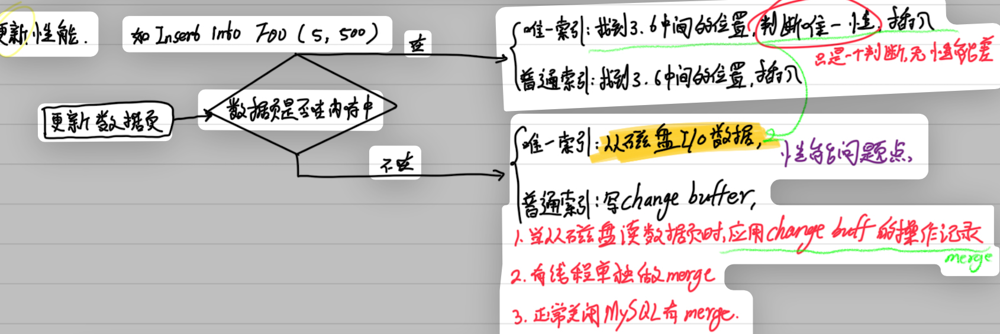

## 锁

<Callout>处理数据库的并发问题</Callout>

### 行锁
update的时候会对行数据加一个写锁, 此时会阻塞其他session的读写操作, 根据两阶段锁协议, 写锁在事务被提交的时候锁才会被释放;

> 所以尽可能把热点的行放在sql的后面, 可以减少阻塞的时间;

- 行锁引发的死锁

    死锁就是并发的时候事务相互占用资源, 死锁可以通过**死锁检测**在死锁的时候回滚其中一个事务解决;
    
    但是死锁检测的时间复杂度是n方的, 比较消耗资源, 可以通过配置文件关闭死锁检测, 如果你确定不会死锁的话;

    或者通过两方面优化:
    1. 控制客户端并发数量;
    2. 优化锁冲突, 把一行变成逻辑上的多行, 比如: 余额=所有余额行相加;

### 表级锁
1. lock table read/write
    > 影响面比较大, 能用行锁就不会用表锁
2. metadata lock

    保证读写的正确性(如果在mysql拉结果集的时候, 有一个线程修改了表结构, 删除了一列, 那表结构和结果集就对不上了), 
    Mdl锁系统会自动加, 在增删改查的时候申请mdl读锁, 在表结构变更的时候申请mdl写锁;

    > 给表加字段也会出问题
    
    |session A      |session B       |session C       |session D|
    |:-------------:|:--------------:|:--------------:|:-------:|
    |begin;         |
    |select * from t limit1;|
    |               |select * from t limit 1;|
    |               |                |alert table t add f int;(blocked)|
    |               |                |                 | select * from t limit 1;(blocked)|

    A加MDL读锁, B加读锁, 读读不互斥, C需要申请写锁, 被阻塞;
    
    只有session C被阻塞无所谓, 但是之后所有要在表上申请mdl读锁的请求也会走session C阻塞;
    
    现在整个表就不可读写了; 
    
    如果某个表上的查询语句频繁，而且客户端有重试机制，也就是说超时后会再起一个新 session 再请求的话，这个库的线程很快就会爆满; 
    
    那如何安全的给表加字段呢? 
    
    需要先查询长事务, 因为锁在commit的时候才会释放, 可以先kill了长事务, 或者等事务提交再ddl;
    
    但是如果是热点表, 请求很频繁, 又必须加一个字段, kill了一个事务, 下一个事务就续上了;
    
    比较理想的机制是，在 alter table 语句里面设定等待时间，
    
    > ALTER TABLE tbl_name WAIT N add column ...
    
    如果在这个指定的等待时间里面能够拿到 MDL 写锁最好，拿不到也不要阻塞后面的业务语句，先放弃。之后开发人员或者 DBA 再通过重试命令重复这个过程;
    
    

### 全局锁
1. flush table with read lock

    全局锁一般用于备份, 比如在配置主从同步的时候, 第一次的全量备份需要使用全局锁获取一个逻辑上一致的时间点, 使用ftwrl保证不会有其他sql修改数据, 备份过程中, 整个库处于只读状态;

2. readonly=true

    设置全局只读, 一般用于逻辑备份, 有的工具会根据readonly判断主从库, 修改readonly影响面比较大, 相较于`ftwrl可以在客户端发生异常断开时自动释放全局锁`, readonly却只能手动修改;

> 可以使用一致性视图进行逻辑备份: 使用mysqldump —single-transaction 可以在导出数据之前启动一个事务, 拿到一个一致性视图, 由于mvcc, 导出期间不影响业务

## MVCC
<Callout>Multi-Version Concurrency Control: 优化并发场景下的读写性能</Callout>

### 一致性视图(consistent read view)

> 用于支持 RC（Read Committed，读提交）和 RR（Repeatable Read，可重复读）隔离级别的实现。

在读提交和可重复读级别下基于一致性视图实现事务, 可以在并发场景下优化读写性能;

从并发的角度理解, 就是尽量不加锁, 当读读, 读写, 写写场景下, 只有写写冲突;

基于二阶段锁协议, 先开始的写操作会阻塞后面的写操作, 直到上锁的事务提交;

两个事务有读写冲突的情况下, 如果是一致性读, 读操作不会被阻塞;
  写操作是当前读, 会加锁;
  基于二阶段锁协议, 会在如update的时候加锁, 在commit的时候释放锁;
  如果不加锁, update之后如果回滚, 那别的事务读到的就是脏数据了;

一致性视图就是创建一个快照, 由undo_log, 和每条数据的row_trx_id(创建这个版本的数据的事务的id)实现;

事务可以根据自己的事务id+活跃id数组, 在undo_log中进行回滚操作找到当前事务可见的版本;

|隔离级别|何时创建一致性视图|
|:-----:|:-------------:|
|rc|在每个sql执行前创建一致性视图|
|rr|在事务之后的第一个sql执行前创建一致性视图|
|读未提交|允许读取未提交的数据, 不需要使用视图|
|串行化|直接使用锁, 不需要使用视图|

### 数据可见性规则

每行数据都有历史记录, 历史记录中有创建它的事务的id, 记为row_trx_id;

事务创建一致性视图, 就是以当前活跃的事务id组成数组, 活跃事务id中的最小值记为最小值, 当前系统的将要分配的下一个事务id记为最大值;
> 活跃事务: 开始了但是还没提交

根据一致性视图和undo_log(行数据的多个版本)  
如果一个版本在最小值之下, 说明是已提交的事务创建的版本, 可见  
如果一个版本大于最大值, 说明是未提交的事务创建的版本, 不可见  
如果一个版本在最小值和最大值中间, 
1. 在数组中, 不可见, 说明是未提交的事务, 
2. 不在数组中, 可见, 说明事务已经提交;

为啥有可能在区间中, 不在数组中呢?
比如[3,4,5,6]这几个事务, 然后创建一致性视图的时候, 事务5提交了, 所以现在最小值就是3, 最大值是6, 5就是已经提交的事务;

### Mvcc在查询和更新场景下的区别
在查询的时候分为一致性读和当前读, 普通的select是一致性读, 遵循版本可见性规则, 根据一致性视图和undolog进行一致性读, 
select for update/for share mode 这种是当前读, 

更新都是当前读, 当前读会加锁, 基于两阶段锁提交协议, 可避免脏读;  
如: 事务B更新了k=1, 然后回滚了, 所有根据k=1这个数据进行操作的事务都操作的是脏数据;

### 一致性读

一般的select是一致性读, 使用mvcc可以根据数据可见性规则和undolog, 在执行一致性读的时候在历史版本中获取当前事务可见的数据版本;

### 当前读
update和select ... for update/for share mode是当前读, 使用锁

### 二阶段锁协议
在事务中加的锁要等到事务提交才能被释放

------

## 普通索引, 唯一索引
<Callout>普通索引在更新场景下的性能优化</Callout>
### 查询性能
如: select * from foo where id = 5;
唯一索引: 查找id符合的数据直接返回;
普通索引: 在b+树的叶子结点遍历所有id符合的数据, 直到找到第一个id不符合的数据, 返回之前所有id符合的数据集;
- 当所有id符合的数据都在当前页上, 且至少最后一条id不符合;
- 数据页最后一条id符合, 需要进行磁盘io获取下一页; 一般情况下一页16KB足够大, 这种情况较少发生;
结论: 普通/唯一索引都可以通过从磁盘获取一页数据查询到结果, 性能无差距;

### Change Buffer
当更新一个数据的时候, 如果是普通索引, 并且数据页不在内存中, 会先写change buffer;

change buffer何时被持久化?
1. 从磁盘读取数据页时, 会合并其在change buffer的记录(这个操作称为merge);
2. 有线程单独做merge;
3. 正常关闭MySQL时会merge;

如果是唯一索引, 因为要判断唯一性, 所以就要把数据页读入内存中, 这个时候就使用不到change buffer, 直接更新内存页就好了;

### 更新性能
如: INSERT INTO foo (5, 500);

### 结论
唯一索引无法使用change buffer, 在更新数据页的时候必须从磁盘io数据进行唯一性校验;
写多读少时: merge的时候change buffer数据量越大, 收益越高; 如日志, 账单场景;
写后立马读时: 写了change buffer后立马读数据, 需要从磁盘io获取数据并进行merge操作,
    这是并未减少io操作, 还多了维护change buffer的损耗;

------

## 索引优化
<Callout>常规的索引优化手段</Callout>
### 覆盖索引
select的字段在二级索引中存在, 直接使用二级索引的信息, 不用回表;
### 索引下推
对索引中包含的字段先做判断，直接过滤掉不满足条件的记录，减少回表次数
mysql5.6之前，根据索引找到对应的ID进行回表，先到主键索引上找出数据行，再对比字段值。
mysql5.6引入的索引下推优化，可以在索引遍历过程中，对索引中的字段先做判断，直接过滤掉不满足条件的记录，减少回表次数。
### 最左前缀
最左前缀匹配原则，组合索引非常重要的原则，
只要满足最左前缀，就可以利用索引来加速检索。这个最左前缀可以是联合索引的最左 N 个字段，也可以是字符串索引的最左 M 个字符。

------

## Online DDL
<Callout type='warn'>表结构变更, 会阻塞读写操作</Callout>
### 问题: 
Online DDL的过程是这样的：
1. 拿MDL写锁
2. 降级成MDL读锁
3. 真正做DDL
4. 升级成MDL写锁
5. 释放MDL锁

1、2、4、5如果没有锁冲突，执行时间非常短。第3步占用了DDL绝大部分时间，这期间这个表可以正常读写数据，是因此称为“online

这种方式有啥优点? 和直接获取写锁, 执行ddl, 释放写锁, 有啥区别,

### 答:
这个 Online DDL 过程非常经典，尤其在像 MySQL (InnoDB) 这样的数据库中，很多工具（如 `pt-online-schema-change`, `gh-ost`）或内建的 Online DDL 功能（如 `ALGORITHM=INPLACE` 的某些操作）都采用了类似的思想。

我们来详细分析一下：

**Online DDL 过程（如你所述）：**

1.  **拿MDL写锁 (Acquire MDL Write Lock):**
    * **目的:** 确保在此DDL操作初始化阶段，没有其他会话正在修改表结构或元数据。这是一个非常短暂的阶段，用于准备DDL环境，比如创建影子表（如果需要）的初始结构。
    * **影响:** 会短暂阻塞对该表的其他DDL以及DML（数据操作语言，如INSERT, UPDATE, DELETE, SELECT）。

2.  **降级成MDL读锁 (Downgrade to MDL Read Lock):**
    * **目的:** 一旦初始准备完成，写锁就不再必要。降级为读锁后，允许其他会话对该表进行读写操作（DML）。但通常会阻止其他对该表的DDL操作。
    * **影响:** 其他DML可以正常进行。

3.  **真正做DDL (Perform actual DDL):**
    * **目的:** 这是耗时最长的阶段。具体实现方式多样：
        * **影子表方式 (Copy-based):** 创建一个与原表结构相同（或即将变成的新结构）的临时表（影子表）。然后将原表数据拷贝到影子表。在此期间，对原表的DML操作会通过触发器或解析binlog等方式同步到影子表。
        * **原地修改方式 (In-place):** 某些DDL操作（如添加允许NULL的列，在MySQL 5.6+的某些情况下修改列默认值，添加二级索引等）可以在不拷贝整个表数据的情况下完成。即使是原地修改，也可能需要扫描表数据或重建部分数据结构。
    * **影响:** 表可以正常读写，这是“Online”的核心。但可能会有性能开销（如触发器、额外的IO、CPU消耗）。

4.  **升级成MDL写锁 (Upgrade to MDL Write Lock):**
    * **目的:** 在数据迁移/修改基本完成后，需要一个短暂的窗口来完成最终的切换。这包括：
        * 应用在第3步积累的最后一部分增量数据。
        * 原子地将原表重命名为备份表，将影子表（或已修改的表）重命名为原表名。
        * 更新相关的元数据。
    * **影响:** 再次短暂阻塞对该表的DML和DDL操作，以确保数据一致性和元数据切换的原子性。这个阶段必须非常快。

5.  **释放MDL锁 (Release MDL Lock):**
    * **目的:** DDL完成，表以新结构对外提供服务。
    * **影响:** 表恢复完全正常访问。

**这种方式的优点：**

1.  **高可用性/减少停机时间 (High Availability / Reduced Downtime):** 这是最核心的优点。在整个DDL操作的大部分时间里（第3步），业务应用仍然可以对表进行读写操作。只有在开始（第1步）和结束（第4步）的极短时间内才需要获取排他锁，从而最大程度地减少了对业务的影响。
2.  **对业务影响小 (Minimal Business Impact):** 由于阻塞时间极短，用户几乎感觉不到服务中断（尽管可能会有性能上的轻微波动）。
3.  **更适合大型表和繁忙系统 (Suitable for Large Tables and Busy Systems):** 对于包含大量数据或访问频繁的表，传统的阻塞式DDL可能会导致数小时甚至数天的服务不可用，这是无法接受的。Online DDL使得这些操作成为可能。
4.  **可回滚性 (Often more Rollback-friendly, depending on implementation):** 很多Online DDL工具，比如使用影子表的方式，如果中途发生错误，可以简单地丢弃影子表，原表不受影响。

**和直接获取写锁, 执行DDL, 释放写锁的区别 (Offline DDL):**

这种“直接获取写锁”的方式通常被称为 **Offline DDL** 或 **Blocking DDL**。

| 特性                 | Online DDL (你描述的方式)                                   | Offline DDL (直接写锁)                                  |
| :------------------- | :------------------------------------------------------------ | :------------------------------------------------------ |
| **核心锁策略** | 在耗时操作期间使用读锁（或无锁，依赖其他机制），仅在关键切换点使用写锁 | 整个DDL期间全程持有写锁                                 |
| **业务影响** | 极小，仅在开始和结束时有非常短暂的阻塞                          | 巨大，整个DDL期间表不可读写（或仅部分可读，不可写）         |
| **阻塞时长** | 非常短（两个短暂的写锁阶段）                                    | 非常长（等于整个DDL执行时间）                             |
| **适用场景** | 生产环境、大型表、高并发业务、对可用性要求高的系统              | 开发/测试环境、小型表、维护窗口期、对可用性要求不高的系统   |
| **实现复杂度** | 高（需要处理并发DML、数据同步、原子切换等）                     | 低（直接修改，无需考虑并发）                              |
| **资源消耗** | 可能更高（如创建影子表需要额外存储，数据同步消耗CPU/IO）          | 相对较低（直接在原表操作）                                |
| **对主从复制的影响** | 可能更复杂，需要确保主从DDL行为一致（例如MySQL的`ALGORITHM=INPLACE`对复制更友好） | 相对简单，DDL语句直接复制到从库执行（但从库也会长时间阻塞） |
| **DDL执行时长** | 由于并发处理和数据同步，总时长可能比Offline DDL略长或显著长      | 相对较快（因为它不需要处理并发写入）                        |

**总结：**

Online DDL 的核心目标是**在执行耗时的表结构变更时，最大限度地减少对业务应用读写操作的阻塞时间**。它通过复杂的锁管理和数据同步机制，将长时间的阻塞操作转变为短时间的阻塞和长时间的并发操作，从而提高了数据库的可用性。相比之下，直接获取写锁执行DDL（Offline DDL）虽然简单直接，但会导致长时间的业务中断，对于大多数生产系统是不可接受的。